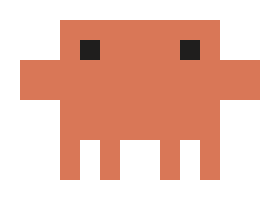

# TaskbarBot

<p align="center">
  
</p>

Two pixel bots that live on your Windows taskbar: they wander, play catch with your app icons, pull pranks, and run from your mouse.

Nothing on your taskbar is ever moved or changed. Everything is drawn on a transparent, click-through window on top of it, and any "borrowed" icon is put back the moment your mouse heads for the taskbar.

## Features

**The bots**

- Two bots standing on the taskbar's edge, always on top; clicks pass straight through them.
- They follow the taskbar to any screen edge (bottom, left, top, right) by leaping across the screen.
- They hide while a fullscreen video or game is in front.
- Touch one with the mouse and it either ducks behind the taskbar or bolts.

**Ten solo moves**

Walk, dash, jump, look around, wave, dance, sleep, spin, squash-bounce, peek. Each bot picks its own moves with pauses in between.

**Scenes that play on their own (one every 1 to 2 minutes)**

- Icon catch: one bot lifts a taskbar icon and they pass it back and forth.
- Fishing: one reels trash up from behind the taskbar, the other tries to catch it in a bin.
- Icon bowling: a ball rolls into three icons, which hop, and the other bot holds up a STRIKE sign.
- Clock graffiti: one sprays the clock, the other sponges it off.
- Window lift: they try to lift the open window and get flattened.
- Mischief: sneak-up scare, piggyback tower, tag, pulling faces.

**Scenes you trigger**

| Do this | They do this |
| --- | --- |
| Leave the PC alone for 2 minutes | Try to steal the Start button with a crowbar |
| Move the mouse fast across the lower half of the screen | Chase it like a laser pointer |
| Click empty taskbar space 3 times quickly | Taunt you |
| Hover an app icon for 4 seconds | Try to shove it off the taskbar |
| Wait for the clock to hit the hour | Graffiti the clock |

**Physics**

Shared gravity for jumps and throws, bounces that lose energy, a springy wobble on every landing, a swinging fishing line, friction and collisions in bowling.

**Tray icon menu**

Right-click the bot icon in the system tray to play any move or scene on demand, change the bot size, turn on "Start with Windows", or exit.

## Requirements

- Windows 10 or 11 (developed and tested on Windows 11)
- [.NET 10 SDK](https://dotnet.microsoft.com/download/dotnet/10.0) to build

## Build

Open a terminal in the project folder (the one with `TaskbarBot.csproj`) and run:

```
dotnet build -c Release
```

The first build downloads the one dependency, [Emoji.Wpf](https://www.nuget.org/packages/Emoji.Wpf), from NuGet, so it needs an internet connection.

The program ends up here:

```
bin\Release\net10.0-windows\TaskbarBot.exe
```

Double-click it, or build and run in one step:

```
dotnet run -c Release
```

Only one copy runs at a time. To stop it, right-click the tray icon and choose Exit. Stop it before rebuilding, or the build cannot replace the running file.

### A single exe that runs without .NET installed

This is how the file on the Releases page is made:

```
dotnet publish -c Release -r win-x64 --self-contained true -p:PublishSingleFile=true -p:IncludeNativeLibrariesForSelfExtract=true -p:EnableCompressionInSingleFile=true -p:DebugType=none -o release
```

The result is one file, `release\TaskbarBot.exe` (about 70 MB, because the .NET runtime is packed inside it).

## Installing

The download on the [Releases](../../releases) page is a release of the binary itself, not a setup installer. `TaskbarBot.exe` is the program: nothing gets installed, no shortcuts are created, and nothing is added to "Installed apps". Download it and double-click it to run. It is a single file with everything inside, so you do not need to install .NET.

For better organizing, copy the downloaded file to a permanent place before you run it, for example a folder such as `C:\TaskbarBot`, or a folder on any other drive. Avoid leaving it in Downloads.

- Do this before turning on "Start with Windows", because that option remembers where the program is.
- Windows may show a "Windows protected your PC" notice the first time, because the file is not signed. Choose **More info** then **Run anyway**.
- To uninstall, exit the bots from the tray icon, untick "Start with Windows" if you turned it on, and delete the file.

If you build it yourself instead (see Build below), the program is a folder of files; keep them together and copy the whole folder.

## Start with Windows

The easy way: right-click the bot icon in the system tray and tick **Start with Windows**. Untick it to turn it off again.

This remembers where `TaskbarBot.exe` is at that moment. If you later move or rename the folder, untick and tick the option again from the new location.

The manual way, if you prefer:

1. Press `Win + R`, type `shell:startup` and press Enter. A folder opens.
2. Right-click `TaskbarBot.exe`, choose **Show more options** then **Create shortcut**.
3. Move that shortcut into the folder from step 1.

To stop it starting with Windows, delete the shortcut, or switch TaskbarBot off under **Task Manager > Startup apps**.

Use one method or the other, not both.

## Command-line switches

These are for trying things out:

| Switch | What it does |
| --- | --- |
| `--demo` | Plays all ten moves once, in order |
| `--scene <name>` | Starts one scene: `catch`, `start`, `fish`, `laser`, `push`, `graffiti`, `bowl`, `moon`, `shove`, `scare`, `tower`, `tag`, `faces` |
| `--edge-tour` | Pretends the taskbar moves to the next screen edge every 7 seconds |

## Project layout

| File | What is in it |
| --- | --- |
| `Program.cs` | The transparent window, finding the taskbar, the tray menu |
| `Bot.cs` | One bot: its pose, the ten moves, drawing |
| `StageView.cs` | Frame loop, mouse tracking, the icon catch game, moving between screen edges |
| `Scenes.cs` | The scripted two-bot scenes and what triggers them |
| `Props.cs` | Things the bots handle: emoji and block-built props |
| `Physics.cs` | Gravity, bounces, friction, springs |
| `Taskbar.cs` | Reading the taskbar's buttons and photographing icons |

## License

The code is released under the [MIT License](LICENSE): you may use, copy, change and share it, as long as the copyright notice and license text stay with it. It comes with no warranty.

Not covered by that license:

- [Emoji.Wpf](https://github.com/samhocevar/emoji.wpf), downloaded at build time, has its own license.
- The emoji pictures come from the Segoe UI Emoji font that ships with Windows and belong to Microsoft.
- The taskbar icons the bots play with are photographed from your own screen while the program runs; none are included here.
- The bot's look is based on the Claude mascot, which belongs to Anthropic. This project is a fan-made toy and is not affiliated with or endorsed by Anthropic.

## Known limits

- Only the primary monitor's taskbar is used.
- The older Windows 10 style taskbar is supported in code but has not been tested.
- The icon of the app you are currently using is skipped in icon scenes, because its highlighted background cannot be separated from the icon.
