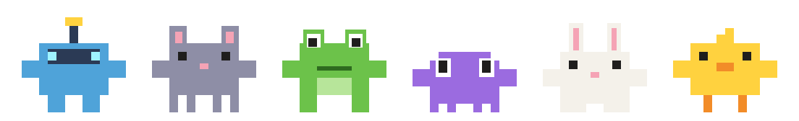

# TaskbarBot

<p align="center">
  
</p>

Six pixel mascots that live on your Windows taskbar: they wander, chat, drink coffee, play catch with your app icons, pull pranks, and run from your mouse.

Nothing on your taskbar is ever moved or changed. Everything is drawn on a transparent, click-through window on top of it, and any "borrowed" icon is put back the moment your mouse heads for the taskbar.

## Features

**The cast**

| Mascot | Who it is | Tends to |
| --- | --- | --- |
| Bolt | Blue robot with an antenna | Spin, dash, work out |
| Mochi | Grey cat | Nap, sit around, chase the mouse |
| Pip | Green frog | Jump and bounce |
| Boo | Purple blob | Hide, peek, look around |
| Bun | White bunny | Bounce, dash, sneeze |
| Chip | Yellow chick | Dance, wave, check its phone |

- All six stand on the taskbar's edge, always on top; clicks pass straight through them.
- They follow the taskbar to any screen edge (bottom, left, top, right) by leaping across the screen.
- They hide while a fullscreen video or game is in front.
- Touch one with the mouse and it either ducks behind the taskbar or bolts.

**Twenty-one solo moves**

- Lively: walk, dash, jump, look around, wave, dance, sleep, spin, squash-bounce, peek.
- Everyday: yawn and stretch, sit and rest, check a phone, sneeze, work out, drink coffee, read a book, eat, sweep up, pace about on a phone call, sing.

Each mascot picks its own moves with pauses in between, weighted by its personality.

**They notice what happens at your PC**

- Come back after being away and they wave hello.
- Plug in the charger and they jump for joy; unplug it and they look around, worried.
- Open a new window and a couple of them look up to see what it is.
- Late at night, on a nearly flat battery, or when nobody is around, they get drowsy: more yawning, sitting and sleeping.

**They use the real taskbar**

- Search box: one jumps in and wades across it, waist-deep, then climbs back out.
- Inside the taskbar: one hops down and strolls along in front of your icons.
- Clock: one bends down to read it, and what it thinks depends on the actual time (coffee in the morning, pizza at lunch, a yawn late at night).
- Battery icon: happy when charging, worried when low, and it tries to charge a low battery by doing jumping jacks.
- Network icon: if the connection drops, two of them go and thump the icon; when it comes back they cheer.
- New app: open a program and two of them come over to inspect its new taskbar icon. Close one and somebody waves goodbye.
- Music: while your PC is playing sound, the free ones dance to it.
- Tray icons as stepping stones: one hops from icon to icon across the corner with the clock, and each icon dips as it lands.
- Tray icon games: they pull a random icon out of the tray corner (the arrow, the language, the network, the speaker, the battery or the clock) and play catch or football with it, then put it back.
- Tray arrow: one uses it as a trampoline, bouncing higher each time and somersaulting off.
- Speaker: one puts an ear to it and reacts to your real volume: puzzled if muted, hands over ears if loud, nodding along otherwise. Changing the volume a lot brings someone over.
- Language button: one tries out greetings in different languages.
- Date: one reads the day off the clock and reacts to it (a party on weekends, a slump on Mondays).

**Scenes that play on their own (roughly one a minute)**

- Icon catch: one bot lifts a taskbar icon and they pass it back and forth.
- Fishing: one reels trash up from behind the taskbar, the other tries to catch it in a bin.
- Icon bowling: a ball rolls into three icons, which hop, and the other bot holds up a STRIKE sign.
- Clock graffiti: one sprays the clock, the other sponges it off.
- Window lift: they try to lift the open window and get flattened.
- Mischief: sneak-up scare, piggyback tower, tag, pulling faces.
- A chat: two of them stop to talk, with speech bubbles.
- Wrecking the icons: one climbs into the taskbar and hurls your pinned icons out, they kick them around, then tidy every one back into its slot.
- A fight: an argument, some shoving, a rolling cloud of blows, then they make up (or sulk).
- A party: all six gather with balloons and confetti. Music that keeps playing sets one off.
- Football, a race, hide and seek, and dinner for two.

Scenes are played by two of the cast at a time; the others carry on with their own business.

**Scenes you trigger**

| Do this | They do this |
| --- | --- |
| Leave the PC alone for 2 minutes | Try to steal the Start button with a crowbar |
| Move the mouse fast across the lower half of the screen | Mochi the cat chases it like a laser pointer |
| Click empty taskbar space 3 times quickly | Taunt you |
| Hover an app icon for 4 seconds | Try to shove it off the taskbar |
| Wait for the clock to hit the hour | Graffiti the clock |

**Physics**

Shared gravity for jumps and throws, bounces that lose energy, a springy wobble on every landing, a swinging fishing line, friction and collisions in bowling.

**Tray icon menu**

Right-click the Bolt icon in the system tray to play any move or scene on demand, change the bot size, turn on "Start with Windows", or exit.

## Requirements

- Windows 10 or 11 (developed and tested on Windows 11)
- [.NET 10 SDK](https://dotnet.microsoft.com/download/dotnet/10.0) to build

## Build

Open a terminal in the project folder (the one with `TaskbarBot.csproj`) and run:

```
dotnet build -c Release
```

The first build downloads the one dependency, [Emoji.Wpf](https://www.nuget.org/packages/Emoji.Wpf), from NuGet, so it needs an internet connection.

The program ends up here:

```
bin\Release\net10.0-windows\TaskbarBot.exe
```

Double-click it, or build and run in one step:

```
dotnet run -c Release
```

Only one copy runs at a time. To stop it, right-click the tray icon and choose Exit. Stop it before rebuilding, or the build cannot replace the running file.

### A single exe that runs without .NET installed

This is how the file on the Releases page is made:

```
dotnet publish -c Release -r win-x64 --self-contained true -p:PublishSingleFile=true -p:IncludeNativeLibrariesForSelfExtract=true -p:EnableCompressionInSingleFile=true -p:DebugType=none -o release
```

The result is one file, `release\TaskbarBot.exe` (about 70 MB, because the .NET runtime is packed inside it).

## Installing

The download on the [Releases](../../releases) page is a release of the binary itself, not a setup installer. `TaskbarBot.exe` is the program: nothing gets installed, no shortcuts are created, and nothing is added to "Installed apps". Download it and double-click it to run. It is a single file with everything inside, so you do not need to install .NET.

For better organizing, copy the downloaded file to a permanent place before you run it, for example a folder such as `C:\TaskbarBot`, or a folder on any other drive. Avoid leaving it in Downloads.

- Do this before turning on "Start with Windows", because that option remembers where the program is.
- Windows may show a "Windows protected your PC" notice the first time, because the file is not signed. Choose **More info** then **Run anyway**.
- To uninstall, exit from the tray icon, untick "Start with Windows" if you turned it on, and delete the file.

If you build it yourself instead (see Build below), the program is a folder of files; keep them together and copy the whole folder.

## Start with Windows

The easy way: right-click the Bolt icon in the system tray and tick **Start with Windows**. Untick it to turn it off again.

This remembers where `TaskbarBot.exe` is at that moment. If you later move or rename the folder, untick and tick the option again from the new location.

The manual way, if you prefer:

1. Press `Win + R`, type `shell:startup` and press Enter. A folder opens.
2. Right-click `TaskbarBot.exe`, choose **Show more options** then **Create shortcut**.
3. Move that shortcut into the folder from step 1.

To stop it starting with Windows, delete the shortcut, or switch TaskbarBot off under **Task Manager > Startup apps**.

Use one method or the other, not both.

## Command-line switches

These are for trying things out:

| Switch | What it does |
| --- | --- |
| `--demo` | One mascot plays every move once, in order |
| `--move <name>` | Plays one move, for example `--move Coffee` |
| `--scene <name>` | Starts one scene: `catch`, `start`, `fish`, `laser`, `push`, `graffiti`, `bowl`, `moon`, `shove`, `scare`, `tower`, `tag`, `faces`, `chat`, `search`, `stroll`, `clock`, `battery`, `wifi`, `mess`, `fight`, `party`, `football`, `race`, `hide`, `dinner`, `trayhop`, `trampoline`, `volume`, `language`, `date`, `traycatch`, `trayball` |
| `--edge-tour` | Pretends the taskbar moves to the next screen edge every 7 seconds |

## Project layout

| File | What is in it |
| --- | --- |
| `Program.cs` | The transparent window, finding the taskbar, the tray menu |
| `Bot.cs` | One mascot: its pose, its moves, drawing |
| `Skin.cs` | The six mascots: their looks and personalities |
| `StageView.cs` | Frame loop, mouse tracking, the icon catch game, moving between screen edges |
| `Scenes.cs` | The scripted scenes, what triggers them, and reactions to the PC |
| `TaskbarScenes.cs` | Scenes with the real taskbar: search box, clock, battery, network, new apps |
| `TrayScenes.cs` | Scenes in the tray corner: stepping stones, trampoline, speaker, language, date |
| `LifeScenes.cs` | Icon wrecking, fights, parties, football, races, hide and seek, dinner |
| `Audio.cs` | Reads the speakers' level so the mascots know when music is playing |
| `Props.cs` | Things the bots handle: emoji and block-built props |
| `Physics.cs` | Gravity, bounces, friction, springs |
| `Taskbar.cs` | Reading the taskbar's buttons and photographing icons |

## License

The code is released under the [MIT License](LICENSE): you may use, copy, change and share it, as long as the copyright notice and license text stay with it. It comes with no warranty.

Not covered by that license:

- [Emoji.Wpf](https://github.com/samhocevar/emoji.wpf), downloaded at build time, has its own license.
- The emoji pictures come from the Segoe UI Emoji font that ships with Windows and belong to Microsoft.
- The taskbar icons the bots play with are photographed from your own screen while the program runs; none are included here.
- The six mascots (Bolt, Mochi, Pip, Boo, Bun and Chip) are original designs made for this project and are covered by the same MIT License.

## Known limits

- The battery, network, speaker and language scenes find those tray icons by their names, which works on English Windows only. On other languages those scenes are skipped.
- The music and volume reactions only read how loud the speakers are and where the volume is set. Nothing is recorded, changed or sent anywhere.
- Only the primary monitor's taskbar is used.
- The older Windows 10 style taskbar is supported in code but has not been tested.
- The icon of the app you are currently using is skipped in icon scenes, because its highlighted background cannot be separated from the icon.
